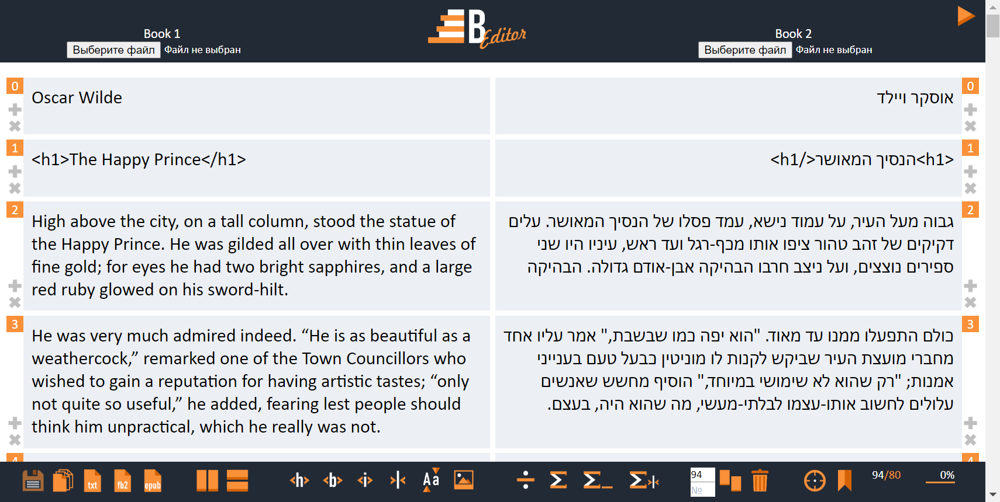
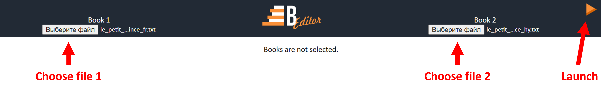
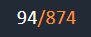

# B-Editor

**B-Editor** is the browser based tool for alignment texts in two different languages. 

Developed by [Bilinguator.com](https://bilinguator.com/).

|**Contents**|
|---|
|[Getting started](#getting-started)|
|[Input texts requirements](#input-texts-requirements)|
|[Loading files](#loading-files)|
|[Manipulation of paragraphs](#manipulation-of-paragraphs)|
|[Editing paragraphs contents](#editing-paragraphs-contents)|
|[Adding illustrations](#adding-illustrations)|
|[Saving files](#saving-files)|
|[Keyboard shortcuts](#keyboard-shortcuts)|
|[Precautions](#precautions)|

## Getting started

The **B-Editor** aligner has been developed and tested in Google Chrome, Yandex Browser, Edge, FireFox browsers. No third-party libraries or frameworks were used during development, except [JQuery](https://jquery.com/) 3.6.0. Our stack consists of HTML, CSS, JavaScript, PHP. We used XAMPP with PHP version 7.4.29 for development.

Put the repository contents to your web server and open [index.php](index.php) file in browser.

## Input texts requirements

Texts must meet the requirements of the [specification](https://github.com/dmitrii-snitkin/aligned-texts#aligned-text-files-specification).

The following scheme of naming your files is highly recommended:

`<BOOK_ID>_<LANG>.txt`, where

* `<BOOK_ID>` is a unique identifier of your book;
* `<LANG>` - ISO code of the language. This part of the file name determines the size and direction of the texts (left-to-right or right-to-left).  

## Loading files

Put your files to be aligned in the [`books`](books/) directory. Launch B-Editor, choose two files in the header and press the `Launch` button (“Play” button-like triangle ) in the top right corner. Then, the paragraphs of the two chosen texts are uploaded.

## Manipulation of paragraphs

### Adding new empty paragraph 

Each paragraph has the plus button () on its side. Clicking it, you can add a new empty paragraph to the current place. Current paragraph and all below will be shifted down.

### Deleting current paragraph

To delete a paragraph, click the diagonal cross () on its side. All the paragraphs below will be shifted up.

### Paragraphs’ indexes

Each paragraph is marked with an index. When clicking an index of a left paragraph, it appears in the upper textarea of toolbar; click a right paragraph’s index, it to appear in the lower textarea (). It is also possible to change the textareas’ values manually. These indexes are useful in the following manipulations.

### Setting bookmark

The bookmark is one index corresponding to a paragraphs couple. To set a bookmark, click to the index of the left paragraph of the current couple or type it to the upper textarea in the toolbar. Click the Bookmark button () to set the bookmark. The bookmark index is saved to the [`books/bookmarks`](books/bookmarks) folder named as `bookmark_<BOOK_ID>_<LANG1>_<LANG2>.<BOOK1_EXTENSION>`. While the file exists, the bookmark is set all the time of using B-Editor, and it is displayed on the right side of the toolbar as `bookmark`/`total paragraphs count` ratio ().

### Moving focus to a paragraph

Click the `bookmark` part of the `bookmark`/`total paragraphs count` ratio to move to the bookmarked paragraph.

To move to any other paragraph, type the index of the paragraph in the upper textarea and click the `To current position` button (). Look at the progress bar to orient ().

### Shifting paragraphs

To shift two paragraphs of different sides to make them adjacent, choose them and click the `Shift` button ().

### Deleting paragraph couples by indexes

To delete several paragraphs on both sides, enter the  ‘from’ and ‘to’ indexes to the textareas. Click the `Delete` button (). Paragraph couples starting from the minimal entered index to the maximal index will be deleted. All the paragraphs below will be shifted up.

### Dividing paragraphs

To divide a paragraph into two, click the position in its content wherein the paragraph must be divided. Press the `Divide paragraph` button ().

To divide a paragraph into several paragraphs, add newline symbols, wherein the paragraph must be divided. Press the `Divide paragraph by newline` button ().

### Concatenating paragraphs

To concatenate two following paragraphs of one side, click on the first of it in any place. Press the `Concatenate paragraphs` button (). The two paragraphs will be merged via empty string. To concatenate two paragraphs via space character or `<delimiter>` press `Concatenate paragraphs via space` () or `Concatenate paragraphs via delimiter` () button respectively.

## Editing paragraphs contents

### Adding tags

Select text in a paragraph. Press `Title` (), `Bold` () or `Italic` () button to tag the selected text with `<h1></h1>`, `<b></b>` or `<i></i>` respectively.

### Adding delimiter

Click on the position in a paragraph. Press the `Add delimiter` button ().

### Switching case

Select a text and press the `Switch case` () to change the case from upper to lower and vice versa.

## Adding illustrations

Put your PNG illustrations to the [`books/illustrations`](books/illustrations) folder. Name them as natural arabiс numbers starting from 1 like [here](https://github.com/bilinguator/bilingual-formats/tree/main/tests/img).

To add a new illustration to the book, create a new empty paragraph, click on it and press `Add illustration` button (). The `<imgℕ>` tag will be inserted, where ℕ is the natural Arabic number. The `<img1>` corresponds to the `books/illustrations/1.png` file.

## Saving files

### Saving source texts

To save two separate source files aligned, click the `Save source files` button () or press `Ctrl`+`S` keys.

### Saving bilingual TXT, FB2 and EPUB books

Clone the git repository of [Bilingual formats](https://github.com/bilinguator/bilingual-formats/) to the root directory of B-Editor. After the next launch of B-Editor, new buttons will appear:

|Button|Action|
|--|---|
||Save TXT|
||Save FB2|
||Save EPUB|

All the books are saved to the [`books/saved`](books/saved) folder.

### Printing bilingual PDF

Clone the git repository of [Print Bilingual PDF](https://github.com/bilinguator/print-bilingual-pdf) to the root directory of B-Editor. After the next launch of B-Editor, new buttons will appear:

|Button|Action|
|--|---|
||Print columns PDF|
||Print rows PDF|

If both [Bilingual formats](https://github.com/bilinguator/bilingual-formats/) and [Print Bilingual PDF](https://github.com/bilinguator/print-bilingual-pdf) are in the B-Editor root directory, the `Save in all formats` button () appears. Press it to save your bilingual book in TXT, FB2, EPUB formats and print the PDF in columns and rows.

## Keyboard shortcuts

|Keys|Button|Action|
|--|--|--|
|`Ctrl`+`S`||Save source files|
|`Ctrl`+`P`||Print columns PDF|
|`Ctrl`+`Shift`+`P`||Print rows PDF|
|`Ctrl`+`H`||Title|
|`Ctrl`+`B`||Bold (when text in paragraph selected)|
|`Ctrl`+`I`||Italic|
|`Ctrl`+`,`||Add delimiter|
|`Ctrl`+`L`||Add illustration|
|`Ctrl`+`D`||Divide paragraph|
|`Ctrl`+ `Shift` + `D`||Divide paragraph by newlines|
|`Ctrl`+`M`||Concatenate paragraphs|
|`Ctrl`+`U`||Concatenate paragraphs via space|
|`Ctrl`+`Y`||Concatenate paragraphs via delimiter|
|`Ctrl`+`O`||To current position|
|`Ctrl`+`B`||Set bookmark (when no text in paragraph selected)|

## Precautions

B-Editor does not suit for working with big texts. When working with texts with more than a thousand paragraphs, the waiting time for some operations can be quite long.